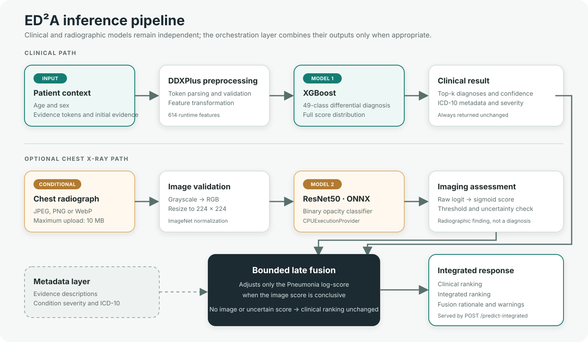
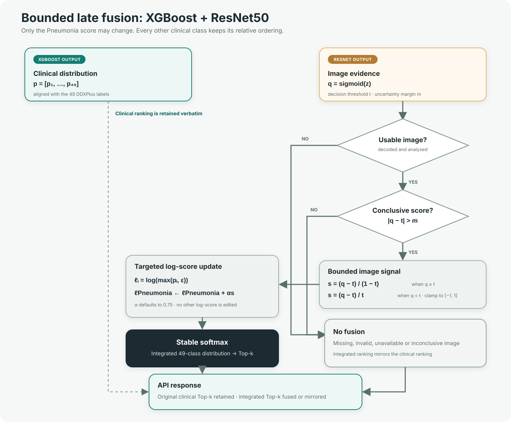

<p align="center">
  
</p>

<h1 align="center">ED²A - Explainable Differential Diagnosis Assistant</h1>

<p align="center">
  An explainable, multimodal decision-support prototype for telemedicine triage.
</p>

ED²A ranks 49 DDXPlus conditions from patient demographics and structured clinical evidence. When the selected evidence makes chest imaging relevant, the application can also process a chest radiograph with an independent ResNet50 model and use the result to re-rank the Pneumonia hypothesis.

## What the application provides

- A FastAPI REST API and a responsive Jinja2 web interface.
- Top-k differential diagnoses from a weighted XGBoost classifier trained on DDXPlus.
- Human readable evidence descriptions, ICD-10 metadata and dataset-derived urgency.
- Optional chest X-ray assessment through a ResNet50 model exported to ONNX.
- Transparent, bounded late fusion that changes only the Pneumonia score.
- A PubMed search panel backed by the official NCBI E-utilities.
- Health, model information and metrics endpoints for deployment checks.

The clinical and radiographic models are deliberately isolated. Either service can be unavailable without preventing the application from starting; `/health` reports the actual readiness of both.

## Architecture



The runtime path is split into four responsibilities:

1. `MetadataService` validates evidence identifiers and resolves the English labels shown in the interface.
2. `ModelService` transforms `AGE`, `SEX`, `EVIDENCES` and `INITIAL_EVIDENCE`, then obtains the complete 49 class distribution from XGBoost.
3. `PneumoniaService` validates and preprocesses an optional chest radiograph before running the ONNX model on CPU.
4. `FusionService` receives both model outputs and applies the deterministic re-ranking rule described below. Neither model calls the other.

### Current model snapshot

| Component | Evaluation split | Selected results |
| --- | --- | --- |
| Weighted XGBoost, 49 classes | DDXPlus held out test set, 134,529 rows | Accuracy `0.9976`, balanced accuracy `0.9968`, macro F1 `0.9971`, Top-5 accuracy `1.0000` |
| ResNet50, binary chest X-ray classifier | RSNA patient-level stratified validation set, 8,006 images | Accuracy `0.7750`, sensitivity `0.8293`, specificity `0.7593`, F1 `0.6242`, ROC-AUC `0.8831` |

These values come from `model_metrics.json` and `advanced_pneumonia_metrics.json`. They describe the project experiments, not external clinical validation. The DDXPlus and RSNA datasets are separate and contain no paired patients.

## Repository layout

```text
.
├── API_App/
│   ├── app.py                         # FastAPI routes and orchestration
│   ├── config.py                      # Runtime paths and fusion settings
│   ├── model_service.py               # DDXPlus/XGBoost inference
│   ├── pneumonia_service.py           # Image validation and ONNX inference
│   ├── fusion_service.py              # Bounded late fusion algorithm
│   ├── clinical_evidence_service.py   # PubMed integration
│   ├── metadata_service.py            # Evidence and condition metadata
│   ├── schemas.py                     # Pydantic request/response contracts
│   ├── templates/index.html
│   ├── static/style.css
│   ├── imgs/ed2a-logo.png
│   ├── metadata/
│   ├── artifacts/
│   ├── tests/
│   ├── Dockerfile
│   ├── compose.yaml
│   └── requirements.txt
├── docs/images/
│   ├── model_pipeline.svg
│   └── fusion_algorithm.svg
├── samples/                           # Demonstration cases and X-rays
└── README.md
```

Training notebooks and raw datasets are not required at runtime and should remain outside the Docker image.

## Quick start with Docker Compose

### Prerequisites

- Docker Desktop installed and running, or Docker Engine with Docker Compose v2;
- The inference artifacts listed in [Model artifacts](#model-artifacts) must be present before the image is built; the container does not download models at runtime.

From the application directory:

```bash
cd API_App
docker compose up --build -d
```

Check the container and follow its logs:

```bash
docker compose ps
docker compose logs -f
```

Open the application after the health check becomes ready:

- Web interface: <http://localhost:8000/>
- OpenAPI/Swagger UI: <http://localhost:8000/docs>
- Health endpoint: <http://localhost:8000/health>

Stop and remove the Compose container and network:

```bash
docker compose down
```

After changing application code, metadata or a model artifact, rebuild the image:

```bash
docker compose up --build -d
```

### Docker CLI without Compose

The build context must be `API_App`:

```bash
cd API_App
docker build --tag ed2a:latest .
docker run --detach --name ed2a --restart unless-stopped --publish 8000:8000 ed2a:latest
```

Useful lifecycle commands:

```bash
docker inspect --format '{{.State.Health.Status}}' ed2a
docker logs --follow ed2a
docker stop ed2a
docker rm ed2a
```

The image uses `python:3.12-slim`, installs the OpenMP runtime required by XGBoost and ONNX Runtime, and runs Uvicorn as the unprivileged `appuser`. A single Uvicorn worker is intentional because each additional worker would load another copy of both models into memory.

## Run locally with Python

Python 3.12 is the project target.

```bash
cd API_App
python -m venv .venv
```

Activate the environment on Windows PowerShell:

```powershell
.\.venv\Scripts\Activate.ps1
```

Or on Linux and macOS:

```bash
source .venv/bin/activate
```

Install the dependencies and start Uvicorn:

```bash
python -m pip install --upgrade pip
python -m pip install -r requirements.txt
python -m uvicorn app:app --host 0.0.0.0 --port 8000 --reload
```

Use `--reload` only during development. Stop the process with `Ctrl+C`.

## API reference

FastAPI also exposes `/docs`, `/redoc` and `/openapi.json` automatically.

| Method | Path | Purpose and main inputs |
| --- | --- | --- |
| `GET` | `/` | Render the web interface. |
| `POST` | `/web-predict` | Server rendered form fallback. Accepts form fields `age`, `sex`, `evidences`, `initial_evidence` and `k`. |
| `GET` | `/health` | Report metadata availability, both model states, artifact freshness and fusion configuration. A `200` response does not by itself mean that both models are ready; inspect `models.*.ready`. |
| `GET` | `/metadata/evidences?limit=100` | List evidence metadata. `limit` accepts `1–1000`. |
| `GET` | `/metadata/evidences/{evidence_id}` | Return the complete metadata record for one evidence identifier. |
| `GET` | `/metadata/conditions?limit=100` | List condition name, ICD-10 identifier and severity. `limit` accepts `1–1000`. |
| `GET` | `/metadata/conditions/{condition_name}` | Return the complete metadata record for one condition; English aliases are accepted case-insensitively. |
| `GET` | `/model-info` | Report the loaded differential model type, class labels and artifact errors. |
| `GET` | `/metrics` | Return `artifacts/model_metrics.json`, or an explicit unavailable response if the file is missing. |
| `GET` | `/api/clinical-evidence` | Search PubMed. Required: `condition`. Optional: `article_type=all|guideline|systematic_review|diagnostic_study`, `years=3|5|10|all`. Returns at most five recent articles. |
| `POST` | `/predict` | Return the default Top-5 clinical differential from a JSON `PredictionRequest`. |
| `POST` | `/predict-topk` | Return `1–20` ranked clinical diagnoses. Adds `k` to the JSON request. |
| `POST` | `/predict-integrated` | Accept multipart form data: a required JSON string in `payload` and an optional `chest_xray` file. Returns the untouched clinical ranking, imaging assessment, fusion rationale and integrated ranking. |

### Clinical request contract

```json
{
  "age": 65,
  "sex": "M",
  "evidences": ["E_201", "E_123", "E_77", "E_66", "E_79"],
  "initial_evidence": "E_201",
  "k": 10
}
```

- `age`: integer from `0` to `130`.
- `sex`: `M` or `F`.
- `evidences`: at least one DDXPlus token. Boolean evidence uses `E_<id>`; valued evidence uses `E_<id>_@_<value>`.
- `initial_evidence`: optional evidence token.
- `k`: available on `/predict-topk` and `/predict-integrated`, from `1` to `20`; the default is `5`.

The inference frame contains only `AGE`, `SEX`, `EVIDENCES` and `INITIAL_EVIDENCE`. `PATHOLOGY`, `DIFFERENTIAL_DIAGNOSIS` and the misspelled `DIFFERENTIAL_DIGNOSIS` are explicitly excluded to prevent target leakage.

### Request examples

Clinical Top-k prediction:

```bash
curl --request POST 'http://localhost:8000/predict-topk' \
  --header 'Content-Type: application/json' \
  --data '{
    "age": 65,
    "sex": "M",
    "evidences": ["E_201", "E_123", "E_77", "E_66", "E_79"],
    "initial_evidence": "E_201",
    "k": 10
  }'
```

Integrated request with a chest X-ray:

```bash
curl --request POST 'http://localhost:8000/predict-integrated' \
  --form 'payload={"age":65,"sex":"M","evidences":["E_201","E_123","E_77","E_66","E_79"],"initial_evidence":"E_201","k":10}' \
  --form 'chest_xray=@samples/chest-xrays/pneumonia-compatible-opacity.png;type=image/png'
```

PubMed search:

```bash
curl --get 'http://localhost:8000/api/clinical-evidence' \
  --data-urlencode 'condition=Pneumonia' \
  --data-urlencode 'article_type=systematic_review' \
  --data-urlencode 'years=5'
```

Only the physician-editable search query and filters are sent to NCBI. Patient demographics and evidence tokens are not forwarded.

### Error behaviour

- `400`: unknown or malformed evidence identifier.
- `404`: requested metadata item not found.
- `422`: request schema or query parameter validation failure.
- `502` / `504`: PubMed upstream failure or timeout.
- `503`: required metadata or differential model artifacts are unavailable.
- `500`: controlled preprocessing, prediction or metrics file error.

An invalid, oversized or unreadable image does not discard a valid clinical result. `/predict-integrated` falls back to `clinical_only` and returns a warning.

## Demonstration samples

`samples/` different samples images and clinical examples have been updated to check the validity of the model. the examples layout structure is as follows:

```text
samples/
├── README.md
├── cases/
│   ├── 01_upper_respiratory.json
│   ├── 02_respiratory_with_xray.json
│   ├── 03_exertional_cardiopulmonary.json
│   ├── 04_sinonasal_allergic.json
│   └── 05_pleuritic_red_flag.json
└── chest-xrays/
    ├── pneumonia-compatible-opacity.png
    ├── no-pneumonia-compatible-opacity-01.png
    ├── no-pneumonia-compatible-opacity-02.png
    └── SOURCES.md
```

All five payloads were executed through the shipped preprocessor and XGBoost model. Their evidence identifiers were checked against `release_evidences.json`, and the panel state was checked against the current frontend trigger logic.

| Sample | Core evidence | Additional evidence | Initial evidence | Expected top-ranked diagnosis | Chest X-ray panel |
| --- | --- | --- | --- | --- | --- |
| `01_upper_respiratory.json` | `E_181` - nasal congestion or clear rhinorrhea; `E_201` - cough; `E_97` - sore throat | `E_48` - lives with four or more people; `E_222` - daily exposure to second-hand cigarette smoke | `E_97` | URTI | Hidden |
| `02_respiratory_with_xray.json` | `E_201` - cough; `E_77` - coloured or increased sputum; `E_66` - significant shortness of breath | `E_123` - known COPD; `E_79` - current smoking | `E_201` | Acute COPD exacerbation / infection | Shown |
| `03_exertional_cardiopulmonary.json` | `E_218` - symptoms worsen with exertion and improve with rest; `E_89` - persistent fatigue or non-restorative sleep | `E_79` - current smoking; `E_71` - hypercholesterolaemia or lipid-lowering therapy; `E_225` - early cardiovascular disease in a close relative | `E_218` | Stable angina | Hidden |
| `04_sinonasal_allergic.json` | `E_181` - nasal congestion or clear rhinorrhea; `E_201` - cough; `E_169` - itching of the nose or back of the throat | `E_226` - predisposition to common allergies; `E_124` - asthma or previous bronchodilator use | `E_181` | Allergic sinusitis | Shown |
| `05_pleuritic_red_flag.json` | `E_151` - swelling; `E_220` - pain worsened by deep inspiration; `E_66` - significant shortness of breath | `E_109` - previous deep-vein thrombosis; `E_196` - surgery within the previous month | `E_220` | Pulmonary embolism | Shown |

These expected outputs are specific to the included artifacts. Re-run the cases whenever the model, preprocessor, label encoder or payloads change. The validation scope and suggested demonstration sequence are documented in `samples/README.md`.

Case 02 uses a 65-year-old male and `k=10`. With the current clinical artifacts, **Acute COPD exacerbation / infection is ranked first at `88.457%` and Pneumonia is ranked seventh at `0.094%`**, so the image-assisted re-ranking remains visible. In a deterministic fusion check using the default threshold and weight, a supporting image-model score of `0.9` increased the Pneumonia value to `0.171%` and moved it from rank 7 to rank 6; a non-supporting score of `0.1` reduced it to `0.052%` and moved it to rank 8. These two image scores are controlled fusion-test inputs, not predictions from the sample radiographs.

Run one of the examples against the JSON endpoint from the repository root:

```bash
curl --request POST 'http://localhost:8000/predict-topk' \
  --header 'Content-Type: application/json' \
  --data-binary '@samples/cases/01_upper_respiratory.json'
```

The five expected outputs above passed schema validation, catalogue validation, deployed model inference and X-ray trigger checks. The examples remain educational software fixtures and do not establish clinical validity.

Chest X-ray samples must be JPEG, PNG or WEBP and no larger than 10 MB. DICOM files are not accepted by the web form. Keep the source and redistribution terms for every example in `samples/chest-xrays/SOURCES.md`; use “pneumonia-compatible opacity” rather than “confirmed pneumonia” when labelling the positive example, in line with the model's actual target.

## Fusion algorithm



Let `p` be the complete clinical class distribution, `q = sigmoid(z)` the image-model score, `t` its decision threshold, `m` the uncertainty margin and `α` the fusion weight.

1. Without a usable image, the integrated ranking mirrors the clinical ranking.
2. If `|q - t| <= m`, the image result is marked inconclusive and no re-ranking is performed.
3. Otherwise, a threshold-relative signal is computed and clipped to `[-1, 1]`:
   - `s = (q - t) / (1 - t)` when `q >= t`;
   - `s = (q - t) / t` when `q < t`.
4. The service converts the normalized clinical scores to log-space and updates only the Pneumonia entry: `log_score[Pneumonia] += α * s`.
5. A numerically stable softmax produces the integrated distribution and Top-k ranking.

The defaults are `α = 0.75` and `m = 0.10`. The original clinical ranking is always returned separately, urgency is never changed by fusion and the relative order of all non-Pneumonia classes is preserved.

## Model artifacts

Expected runtime layout:

```text
API_App/artifacts/
├── best_model.pkl
├── preprocessor.pkl
├── label_encoder.pkl
├── model_metrics.json
├── artifact_manifest.json
└── advanced_pneumonia/
    ├── advanced_pneumonia_model.onnx
    ├── advanced_pneumonia_config.json
    └── advanced_pneumonia_metrics.json
```

| File | Runtime role |
| --- | --- |
| `best_model.pkl` | Weighted XGBoost differential diagnosis model. |
| `preprocessor.pkl` | Converts the four non-leaking request fields into the model feature space. |
| `label_encoder.pkl` | Preserves class-label alignment for prediction probabilities. |
| `model_metrics.json` | Returned by `GET /metrics`; not needed to compute a prediction. |
| `artifact_manifest.json` | Model provenance and checksums; regenerate it whenever artifacts change. |
| `advanced_pneumonia_model.onnx` | ResNet50 inference graph used by ONNX Runtime. |
| `advanced_pneumonia_config.json` | Input shape, normalization, ONNX I/O names, class mapping and decision threshold. |
| `advanced_pneumonia_metrics.json` | Experiment metrics for the image model. |

`advanced_pneumonia_checkpoint.pt` is training-only. The API never imports PyTorch or torchvision, and `.dockerignore` excludes the checkpoint and `artifacts/old/` from the image.

The ONNX graph is approximately 94 MB. If it is versioned in Git, use Git LFS and verify that the working copy is the binary model rather than a small pointer file before building the image:

```bash
git lfs pull
git lfs ls-files
```

Do not commit local virtual environments, Python caches, test caches or obsolete artifacts.

## Runtime configuration

| Variable | Local default | Docker default / purpose |
| --- | --- | --- |
| `MODEL_DIR` | `API_App/artifacts` | `/app/artifacts` |
| `PNEUMONIA_MODEL_DIR` | `<MODEL_DIR>/advanced_pneumonia` | `/app/artifacts/advanced_pneumonia` |
| `DDXPLUS_DATA_DIR` | `<project-root>/data/raw` | Optional alternative raw-data/metadata directory. |
| `EVIDENCES_JSON_PATH` | `data/raw/release_evidences.json`, then `API_App/metadata/...` | `/app/metadata/release_evidences.json` |
| `CONDITIONS_JSON_PATH` | `data/raw/release_conditions.json`, then `API_App/metadata/...` | `/app/metadata/release_conditions.json` |
| `EVIDENCE_DISPLAY_EN_PATH` | `data/raw/evidence_display_en.json`, then `API_App/metadata/...` | `/app/metadata/evidence_display_en.json` |
| `PNEUMONIA_FUSION_ALPHA` | `0.75` | Valid range: `0 <= α <= 2`. |
| `PNEUMONIA_FUSION_UNCERTAINTY_MARGIN` | `0.10` | Valid range: `0 <= m < 0.5`. |
| `PNEUMONIA_DDX_LABEL` | `Pneumonia` | Clinical class targeted by fusion. |
| `NCBI_EMAIL` | unset | Optional contact email sent with NCBI E-utilities requests. |
| `NCBI_API_KEY` | unset | Optional NCBI API key. |

An invalid fusion range disables fusion and is reported in `/health`; it does not prevent the clinical model from running.

## Tests and operational checks

Run the automated tests from `API_App`:

```bash
python -m pytest -q
```

Check the application from a shell:

```bash
curl --fail http://localhost:8000/health
curl --fail http://localhost:8000/model-info
```

In PowerShell, the equivalent health request is:

```powershell
Invoke-RestMethod http://localhost:8000/health | ConvertTo-Json -Depth 6
```

A fully ready deployment reports:

```text
metadata_loaded: true
conditions_loaded: true
models.differential_diagnosis.ready: true
models.advanced_pneumonia.ready: true
fusion.available: true
```

## Scientific and clinical limitations

- The application is educational decision support, not a medical device.
- DDXPlus and RSNA are independent, unpaired datasets. The fusion weight was not learned or validated on paired clinical and radiographic observations.
- The ResNet50 target is a radiologist annotated pulmonary opacity compatible with pneumonia, not a complete pneumonia diagnosis.
- `image_model_score` and the integrated model scores are not validated calibrated clinical probabilities.
- Fusion targets only the DDXPlus `Pneumonia` class. It cannot use the binary image model to distinguish bronchitis, tuberculosis, pulmonary neoplasm or other thoracic conditions.
- Dataset severity is displayed for triage context and is never modified by the X-ray result.
- The application does not provide treatment recommendations.
